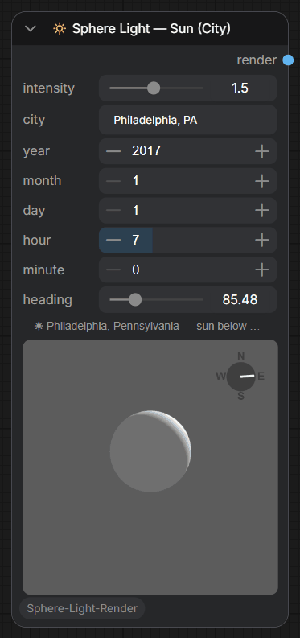
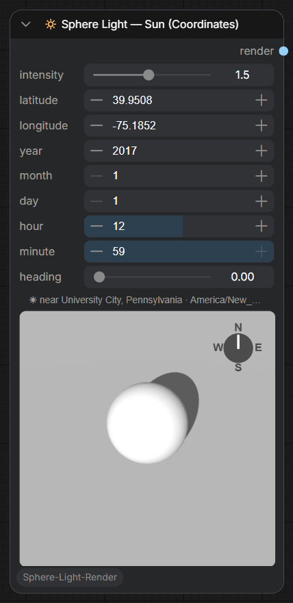
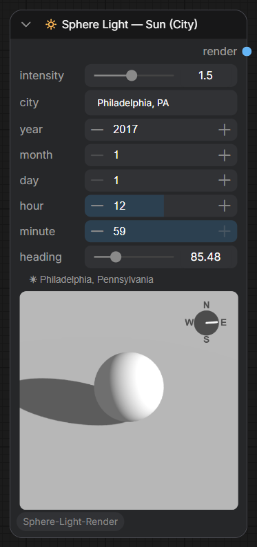
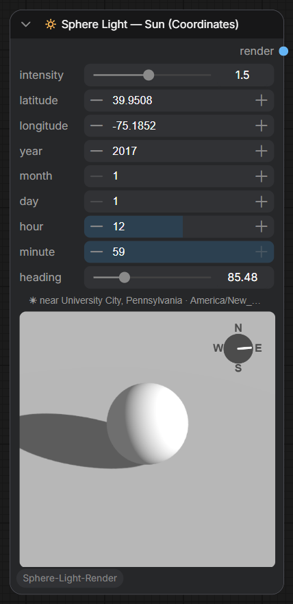
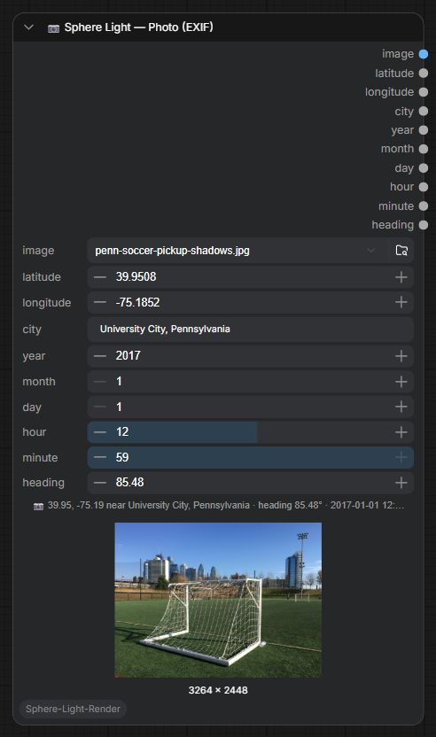
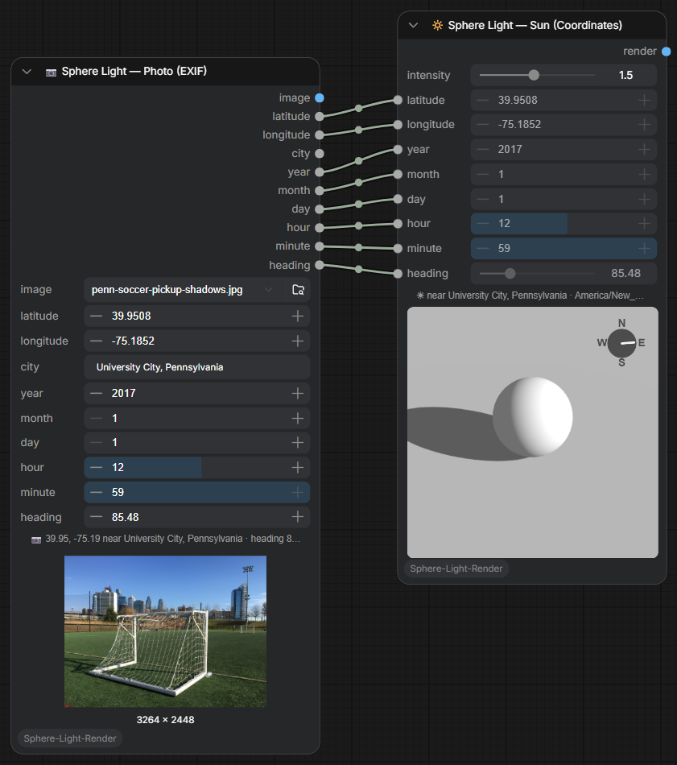

# Sphere-Light-Render-Sundial-ComfyUI
Widget to tell Flux 2 Klein 9B where the sun light comes from — set it by hand,
from a real place and time, or straight from a photo's EXIF. To be used with
Sun_direction_Lora for Flux2Klein.

> **Origin & credit** — this is an independently maintained continuation of
> [Sphere-Light-Render-ComfyUI](https://github.com/eric-venti-seeds/Sphere-Light-Render-ComfyUI)
> by [eric-venti-seeds](https://github.com/eric-venti-seeds), who created the
> original node and the companion Sun-Direction LoRA. Everything this fork
> changed is listed in [CHANGELOG.md](CHANGELOG.md); licensing details are in
> [NOTICE.md](NOTICE.md).

## Install

Clone into your `ComfyUI/custom_nodes/`:

```bash
cd ComfyUI/custom_nodes/
git clone https://github.com/ChristopherConnock/Sphere-Light-Render-Sundial-ComfyUI.git
```

Restart ComfyUI. No additional Python dependencies for the core node.

## Quick start

Download the Lora from here:

https://huggingface.co/eric-venti-seeds/Sun-Direction-Lora-Flux2Klein9B


The Node renders a 1024 x 1024 image as reference for the LoRA to understand where the light comes from.

All the examples below use one real photo — a New Year's Day pickup soccer game
at Penn Park, Philadelphia (bundled as
[`docs/media/penn-soccer-pickup-shadows.jpg`](docs/media/penn-soccer-pickup-shadows.jpg)) —
whose EXIF places it at `39.9508, -75.1852`, facing `85.48°`, on
`2017-01-01 12:59`. The low winter sun gives it long, unambiguous shadows.

<p align="center">
  
  &nbsp;&nbsp;
  
</p>
<p align="center"><em>Left: the photo's Philadelphia New Year's Day swept 07:00 → 18:00 — the light tracks the real winter sun, from below-horizon dawn to long afternoon shadows to dusk.
Right: spinning <code>heading</code> through a full turn — the compass and the camera-relative light rotate together.</em></p>

## Nodes

Four nodes are registered under **render/3d** — the node you pick *is* the mode,
so there are no mode toggles:

- **🔆 Sphere Light — Manual** — set the light directly with `rotation` /
  `elevation` / `intensity`.
- **🔆 Sphere Light — Sun (City)** — position the light from the real sun: type a
  city (e.g. `Austin, TX`, `London, UK`, `Tokyo, Japan`), set date/time and
  `heading`.
- **🔆 Sphere Light — Sun (Coordinates)** — same, but enter `latitude` /
  `longitude` directly (timezone borrowed from the nearest listed city).
- **📷 Sphere Light — Photo (EXIF)** — upload a photo; its EXIF supplies
  `latitude`/`longitude`, the nearest `city`, `heading` (`GPSImgDirection`),
  and the capture date/time as outputs — wire them into the Sun nodes to light
  the sphere the way the sun actually was when and where the photo was taken.
  The photo itself comes out as `IMAGE`, so it can stand in for a Load Image
  node for ordinary photos (no `MASK` output).

<p align="center">
  
  
  
  
</p>

On the Sun nodes, `heading` is the direction the camera faces (degrees clockwise
from North, matching EXIF `GPSImgDirection`); a small compass in the corner of
the preview shows it at a glance. A status line shows what was resolved
(`☀ London, England`) or warns when a city isn't found. Timezone and
daylight-saving are handled automatically. The bundled city list covers cities
over ~15k population; rebuild it with `python tools/build_cities.py`.

### Driving inputs from the graph

Every positioning parameter (heading, city, lat/lon, date/time, intensity, and
Manual's rotation/elevation) can be driven by an upstream node — wire a
**Primitive** (or any node whose value the browser can read) into the
corresponding input. A connected input **wins** over the on-node control, and
the control mirrors the driven value so the field always shows what's actually
used; disconnect it and the widget (still holding the last driven value)
drives again.

The sphere renders client-side (Three.js), and the browser bakes the resolved
value into the rendered image *before each run* — so the output matches the driven
value on the same queue (incrementing an animation frame-by-frame works). This
means **an open ComfyUI browser tab is required** for driven inputs, and the
driving value must be one the browser can resolve (a Primitive/static source, not
a value computed mid-run by another node). A headless/API run, or a value that
only exists during execution, isn't reflected — use the widgets for those.

### From a photo's EXIF

The Photo (EXIF) node reads the metadata in the browser when you pick the
image and writes the values onto its widgets (a status line shows what was
found). Tags the photo doesn't carry — phones only record `GPSImgDirection`
when the compass was active — leave their widgets untouched, so you can type a
correction by hand. Like all driven inputs, an open browser tab is what bakes
fresh values in; headless runs reuse the last-saved ones. JPEG, PNG (`eXIf`),
and WebP files carry EXIF; HEIC is not supported (ComfyUI can't decode it
either).

Wire the outputs into a Sun node and the sphere is lit the way the sun actually
was when and where the photo was taken — here the bundled Penn Park photo
drives Sun (Coordinates), whose widgets mirror the driven values:

<p align="center">
  
</p>

## Development

- JS unit tests: `npm test` (Node's built-in runner over `tests/`).
- Python node tests: run the scripts in `tools/` (`test_decode.py`,
  `test_new_nodes.py`, `test_photo_exif.py`, `test_comfy_load.py`).
- `js/` is the `WEB_DIRECTORY` ComfyUI serves — every `.js` file in it is
  auto-imported by the browser, so only runtime modules live there.

## License & credits

- Original concept and implementation by
  [eric-venti-seeds](https://github.com/eric-venti-seeds)
  ([original repo](https://github.com/eric-venti-seeds/Sphere-Light-Render-ComfyUI)) —
  see [NOTICE.md](NOTICE.md) for how this fork relates to it.
- This fork's contributions are released under the [MIT License](LICENSE).
- City data derived from [GeoNames](https://www.geonames.org/)
  ([CC BY 4.0](https://creativecommons.org/licenses/by/4.0/)).
- [Three.js](https://threejs.org/) r128 (MIT) is vendored as `js/three.min.js`.
- The demo photo in the README (`docs/media/penn-soccer-pickup-shadows.jpg`)
  was taken by the repo author — chosen because its EXIF carries GPS
  coordinates, a compass heading, and the capture time, and its low winter sun
  casts clear shadows to compare against.
